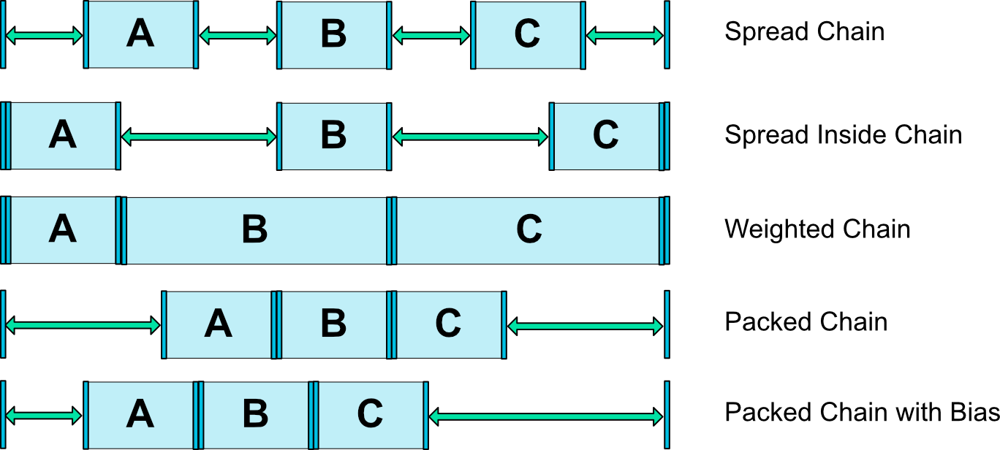

<h1>ConstraintLayoutChains</h1> 

En este ejemplo se muestra cómo crear dos cadenas en el diseño
`ConstraintLayout`:
* Una cadena horizontal de letras:
  `app:layout_constraintHorizontal_chainStyle`
* Una cadena vertical de números :
  `app:layout_constraintVertical_chainStyle` 
  
 Con las cadenas se consigue agrupar un conjunto de vistas y distribuir
 el espacio entre ellas según un estilo que se aplicará a la cadena:
 
  